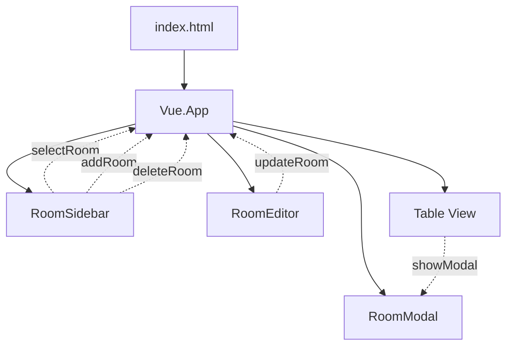

# Application Architecture

## 📂 Directory Structure
```
hydraulic-balance-viewer/
├── index.html                    # Main HTML with Vue mount point
├── package.json                  # Dependencies and scripts
├── vite.config.js               # Build configuration
├── sample-data.json             # Example data (18 rooms)
├── src/
│   ├── main.js                  # Vue app initialization & state
│   ├── style.css                # Global styles
│   └── components/              # Vue components
│       ├── RoomSidebar.js      # Room navigation
│       ├── RoomEditor.js       # Room editing form
│       └── RoomModal.js        # Room details modal
└── ai_docs/                     # AI documentation (this folder)
```

## 🏗 Component Architecture



## 📊 State Management

### Central State (in main.js)
```javascript
{
  buildingData: {           // Main data object
    gebaeude: {...},       // Building metadata
    raeume: [...]          // Array of rooms
  },
  currentView: 'detail',    // 'detail' | 'table'
  currentEditRoomIndex: 0,  // Currently selected room
  showModal: false,         // Modal visibility
  selectedRoom: null        // Room for modal display
}
```

### Data Flow Pattern
1. **File Upload** → `buildingData` populated
2. **User Selection** → `currentEditRoomIndex` updated
3. **User Edit** → Component emits → Parent updates `buildingData`
4. **Export** → `buildingData` → JSON file

## 🧩 Component Responsibilities

### index.html
- Vue mount point (`#app`)
- Component templates (if inline)
- Bootstrap/Vue CDN imports
- Two main views: Detail and Table

### src/main.js
- Vue app creation and configuration
- State management (reactive refs)
- Business logic methods
- Component registration
- Event handlers

### src/components/RoomSidebar.js
**Purpose**: Floor-based room navigation
- Props: `buildingData`, `currentEditRoomIndex`
- Emits: `selectRoom`, `addRoom`, `deleteRoom`
- Features: Tabbed floors, room counts, active highlighting

### src/components/RoomEditor.js
**Purpose**: Full room editing interface
- Props: `room`, `roomIndex`
- Emits: `updateRoom`
- Features: All field editing, auto-calculations, array management

### src/components/RoomModal.js
**Purpose**: Read-only detailed room view
- Props: `room`, `show`
- Emits: `close`
- Features: Complete data display, aggregations

## 🔄 Key Interactions

### Room Selection Flow
```
User clicks room in sidebar
→ RoomSidebar emits 'selectRoom' with index
→ main.js updates currentEditRoomIndex
→ RoomEditor receives new room prop
→ RoomEditor creates local copy for editing
```

### Room Update Flow
```
User edits field in RoomEditor
→ Local update in component
→ Component emits 'updateRoom' with full room object
→ main.js updates buildingData.raeume[index]
→ All components re-render with new data
```

### Add Room Flow
```
User clicks "Raum hinzufügen"
→ RoomSidebar emits 'addRoom' with floor
→ main.js creates default room object
→ Pushes to buildingData.raeume
→ Sets currentEditRoomIndex to new room
```

## 🎨 Styling Architecture

### CSS Organization
- **Bootstrap 5.3**: Base styling framework
- **src/style.css**: Custom overrides and additions
- **Component styles**: Inline in templates

### Key CSS Classes
```css
.main-container     /* App wrapper */
.sidebar           /* Room navigation */
.content-area      /* Main editing area */
.room-item         /* Individual room in sidebar */
.form-section      /* Grouped form fields */
.array-item        /* Repeatable items (windows, doors) */
.nested-object     /* Complex nested data */
```

## 📦 Build System

### Development
```bash
npm run dev        # Vite dev server with HMR
# Serves from http://localhost:5173
```

### Production
```bash
npm run build      # Creates dist/index.html
# Single file with all assets inlined
```

### Preview
```bash
npm run preview    # Test production build
# Serves from http://localhost:4173
```

## 🔌 External Dependencies

### Runtime (via CDN)
- Vue.js 3.x (global build)
- Bootstrap 5.3 CSS
- Bootstrap Icons
- Bootstrap JS Bundle

### Build Time (npm)
- Vite 7.1
- vite-plugin-singlefile (bundles everything)

## 🔐 Security Considerations
- No backend/API calls
- All data processing client-side
- File system access via browser FileAPI only
- No external data transmission

## 🚀 Performance Notes
- Single-page application (no routing)
- Reactive updates via Vue 3 Proxy
- Minimal re-renders (component-level)
- Handles 18+ rooms without lag
- Build output ~71KB gzipped